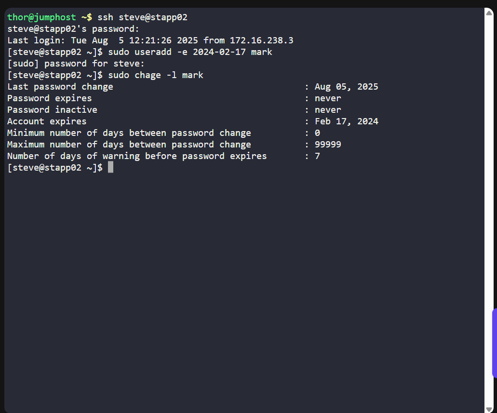

# 🧪 100 Days of DevOps – Day 2  
## ✅ Task 2: Create a User with Expiry Date on App Server 2

---

### 📝 Task Description

Create a user named `mark` (lowercase) on **App Server 2** in the Stratos Datacenter.  
Set the **account expiry date** to: `2024-02-17`.

---

### 🔁 Step 1: SSH into App Server 2

From the jump host, connect to **App Server 2**:

```bash
ssh steve@stapp02
```

- steve – username
- stapp02 – hostname of App Server 2
> 📝 Type yes if prompted to confirm connection.

---

### 🔐 Step 2: Enter the Password
When prompted, enter the provided password (e.g., `Am3ric@` or as given in your lab).
> ⚠️ Password input is hidden — just type and press Enter.

---

### 👤 Step 3: Create the User with Expiry Date
Run the following command:

```bash
sudo useradd -e 2024-02-17 mark
```

- `-e` specifies the expiry date in `YYYY-MM-DD` format.
- The username must be lowercase.
- Enter the password for the username (e.g., `Am3ric@` or as given in your lab).

---

### 🔍 Step 4: Verify the User

Check that the user `mark` exists and has the correct expiry:

```text
Account expires    : Feb 17, 2024
```

## ✅ Task Complete!



You can now type `exit` to disconnect from `App Server 2` and return to the jump host.


