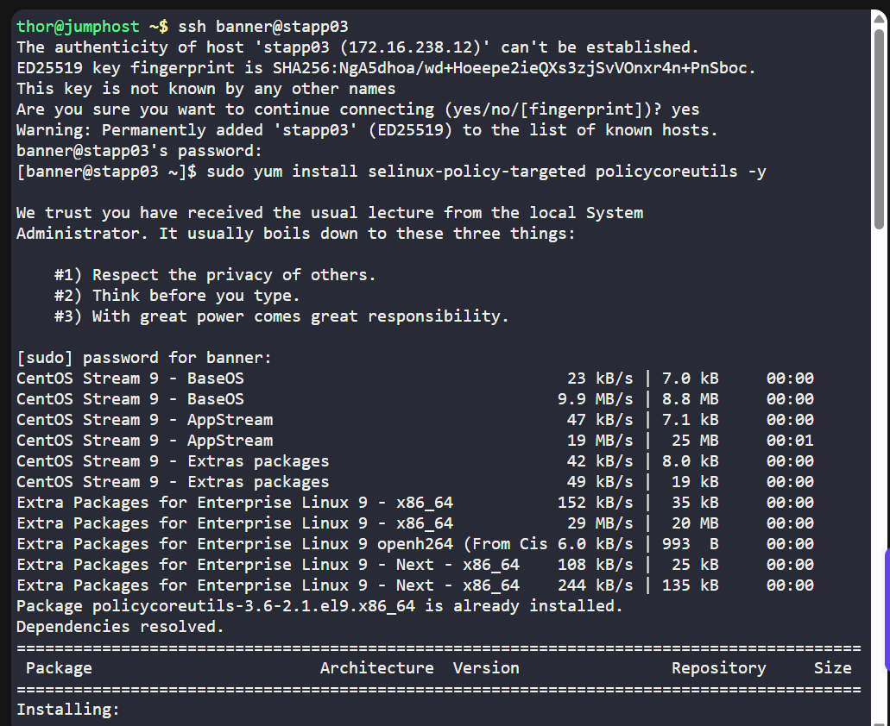
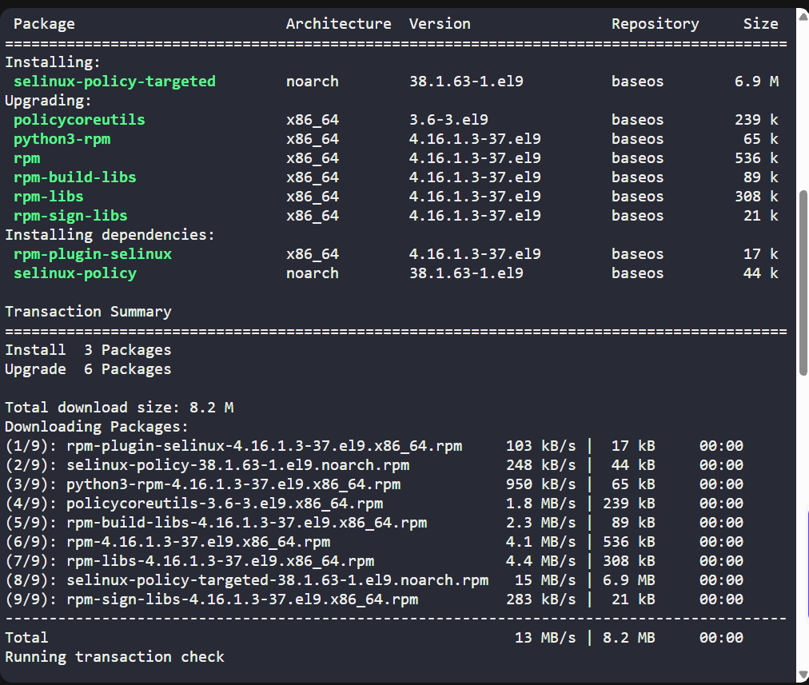
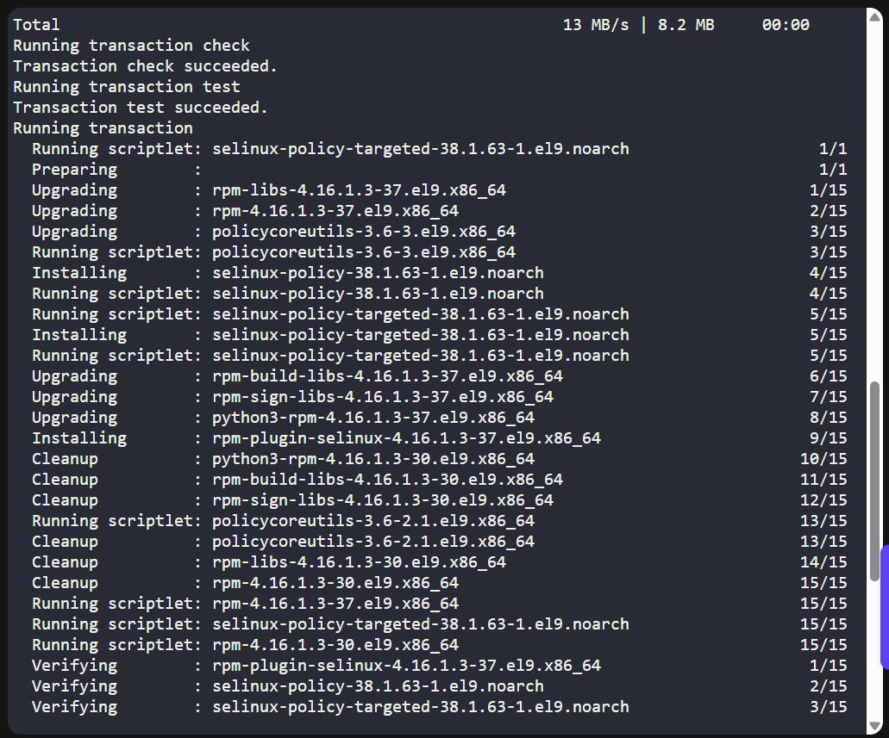
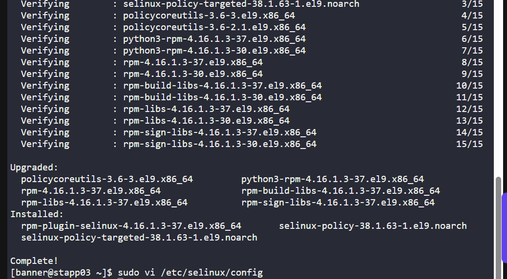
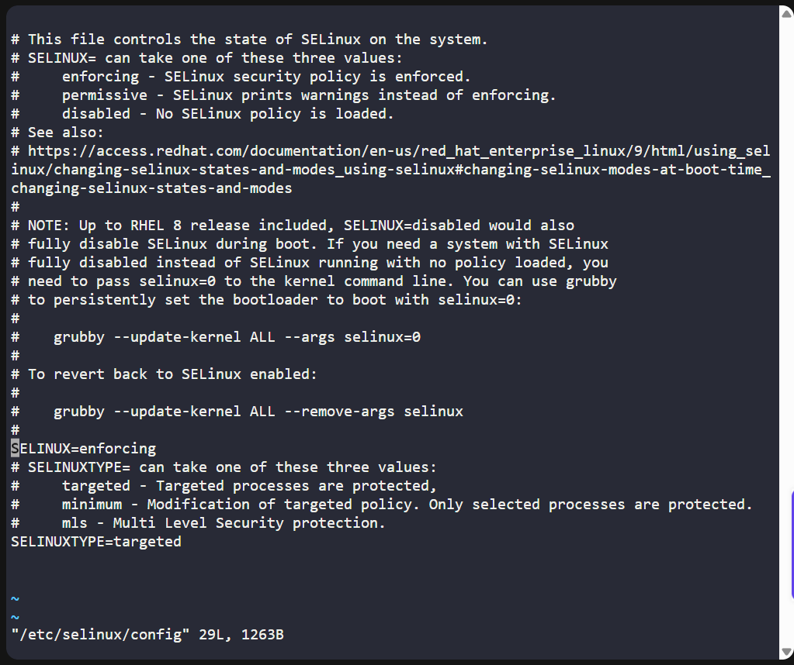
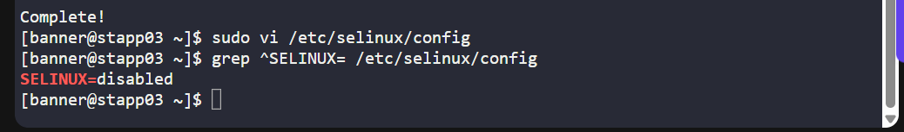

# 🧪 100 Days of DevOps – Day 1  
## ✅ Task 5: SElinux Installation and Configuration

---

### 📝 Task Description

Following a security audit, the xFusionCorp Industries security team decided to implement SELinux.  
For **App Server 3**, the current requirements are:

1. Install required SELinux packages.  
2. Permanently disable SELinux for now (it will be re-enabled later).  
3. No need to reboot — a scheduled maintenance reboot will happen tonight.  
4. Ignore the current runtime status — only ensure that SELinux will be **disabled** after reboot.

---

### 🔁 Step 1: SSH into App Server 3

From the jump host, connect to **App Server 3**:

```bash
ssh banner@stapp03
```
- `banner` – username
- `stapp03` – hostname of App Server 1
> 📝 If prompted, confirm with yes and press Enter.

---

### 🔐 Step 2: Enter the Password

When prompted, type the password below and press Enter:

```css
BigGr33n
```

> ⚠️ The password is invisible while typing — just type it and hit Enter.

---

### 📦 Step 3: Install SELinux Packages

Run:

```bash
sudo yum install selinux-policy selinux-policy-targeted policycoreutils -y
```

> This installs the necessary SELinux policy and management tools.

### Command Description: `sudo yum install selinux-policy selinux-policy-targeted policycoreutils -y`

| Part                         | Description |
|------------------------------|-------------|
| `sudo`                       | Runs the command with superuser (root) privileges — required for installing packages. |
| `yum`                        | The package manager used by RHEL, CentOS, and other Red Hat–based Linux distributions to install, update, and remove software. |
| `install`                    | Tells `yum` to install one or more packages. |
| `selinux-policy`             | Base SELinux policy package that defines security rules for the system. |
| `selinux-policy-targeted`    | A targeted SELinux policy where SELinux protects specific services and processes rather than the entire system. |
| `policycoreutils`            | A collection of utilities for managing SELinux, including commands like `semanage` and `restorecon`. |
| `-y`                         | Automatically answers “yes” to prompts, allowing the install to proceed without manual confirmation. |

---

#### Purpose
This command installs the core SELinux policies and management tools needed to configure and run SELinux (Security-Enhanced Linux). It ensures:
- The base SELinux rules are available  
- The targeted policy is applied  
- Admin utilities are installed for configuration and troubleshooting

---

### 🛠️ Step 4: Permanently Disable SELinux

Open the SELinux configuration file:

```bash
sudo vi /etc/selinux/config
```

Find the line:

```ini
SELINUX=enforcing
```

Change it to:

```ini
SELINUX=disabled
```

### 💾 Step 5: Save and Exit

In `vi`:
- Press `Esc`
- Type `:wq`
- Press `Enter`

---

🔍 Step 6: Verify the Change in Config File

```bash
grep ^SELINUX= /etc/selinux/config
```

Expected output:

```bash
SELINUX=disabled
```

---

## ✅ Task Complete!







