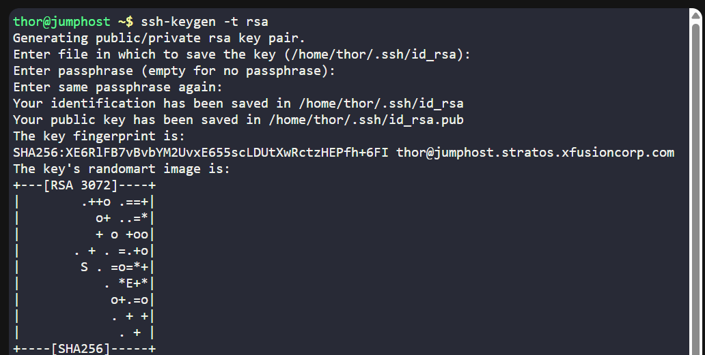
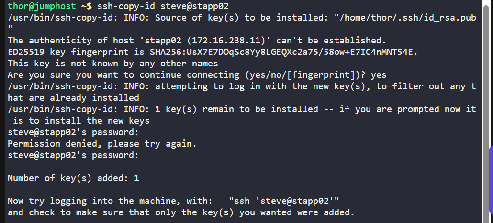
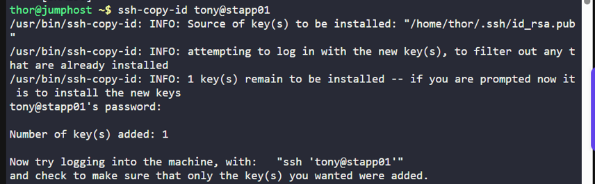
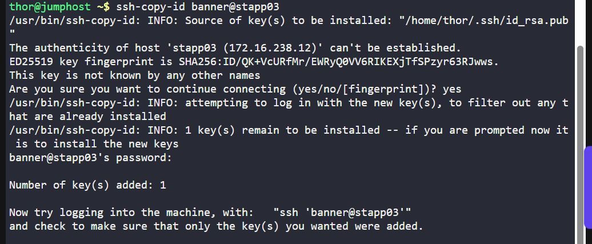
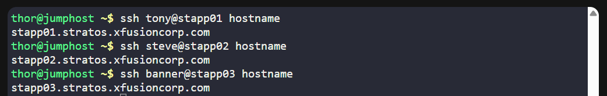

# 🧪 100 Days of DevOps – Day 7  
## ✅ Task 7: Linux SSH Authentication

```text
The system admins team of xFusionCorp Industries has set up some scripts on jump host that run on regular intervals and perform operations on all app servers in Stratos Datacenter.
To make these scripts work properly we need to make sure the thor user on jump host has password-less SSH access to all app servers through their respective sudo users
(i.e tony for app server 1). Based on the requirements, perform the following:

1. Set up a password-less authentication from user thor on jump host to all app servers through their respective sudo users.
```

---

### 📝 Task Description

The xFusionCorp Industries system admins team needs scripts on the jump host to access all app servers automatically.  
Requirement:  

- `thor` on the jump host should have **password-less SSH access** to:
  - **App Server 1** → via user `tony`
  - **App Server 2** → via user `steve`
  - **App Server 3** → via user `banner`

---

### 🔁 Step 1: Log in as `thor` on the Jump Host

You should already be on the jump host prompt:

```bash
thor@jumphost ~$ 
```

If not, switch to `thor`:

```bash
su - thor
```

### Command Description: `su - thor`

| Part   | Description |
|--------|-------------|
| `su`   | Stands for **substitute user** — allows you to switch to another user account. |
| `-`    | Starts a **login shell**, loading the target user’s environment variables, PATH, and profile settings as if they logged in directly. |
| `thor` | The username of the account you want to switch to. |

#### Purpose
This command switches the current session to the `thor` user and loads that user’s full login environment.  
It’s useful for running commands as another user without logging out or opening a new terminal.

---

### 🔑 Step 2: Generate SSH Key Pair

```bash
ssh-keygen -t rsa
```

- Press `Enter` to accept the default file location `(/home/thor/.ssh/id_rsa)`.
- Press `Enter` for no passphrase.

### Command Description: `ssh-keygen -t rsa`

| Part         | Description |
|--------------|-------------|
| `ssh-keygen` | A utility used to create, manage, and convert authentication keys for SSH (Secure Shell). |
| `-t`         | Specifies the **type** of key to create. |
| `rsa`        | Indicates the key type is **RSA** (Rivest–Shamir–Adleman), a widely used public-key cryptosystem. |

#### Purpose
Generates a new **RSA SSH key pair** (public and private key) that can be used for secure, passwordless authentication to remote servers.

How It Works
1. **Prompt for file location** – By default, it saves to `~/.ssh/id_rsa` (private key) and `~/.ssh/id_rsa.pub` (public key).
2. **Prompt for passphrase** – Optional; adds extra security.
3. **Generates keys** – The public key can be shared, but the private key must be kept secure.




---

### 📤 Step 3: Copy Public Key to Each App Server

For App Server 1 (tony@stapp01):
```bash
ssh-copy-id tony@stapp01
```
- Enter `tony's` password when prompted.



For App Server 2 (steve@stapp02):
```bash
ssh-copy-id steve@stapp02
```
- Enter `steve's` password when prompted.



For App Server 3 (banner@stapp03):
```bash
ssh-copy-id banner@stapp03
```
- Enter banner's password when prompted.



### Command Description: `ssh-copy-id`

| Part          | Description |
|---------------|-------------|
| `ssh-copy-id` | A script that installs your **public SSH key** on a remote server for passwordless login. |

#### Purpose
Automatically appends your **public key** to the `~/.ssh/authorized_keys` file on a remote server, enabling you to connect without entering a password each time.

How It Works
1. Reads your **public key** file (default: `~/.ssh/id_rsa.pub`).
2. Connects to the remote server using **SSH**.
3. Appends the public key to the `~/.ssh/authorized_keys` file of the target user.

---

### 🔍 Step 4: Test Password-less Access
Run the following from the jump host as `thor`:

```bash
ssh tony@stapp01 hostname
ssh steve@stapp02 hostname
ssh banner@stapp03 hostname
```
> Each should return the server’s hostname without asking for a password.



---

## ✅ Task Complete!
