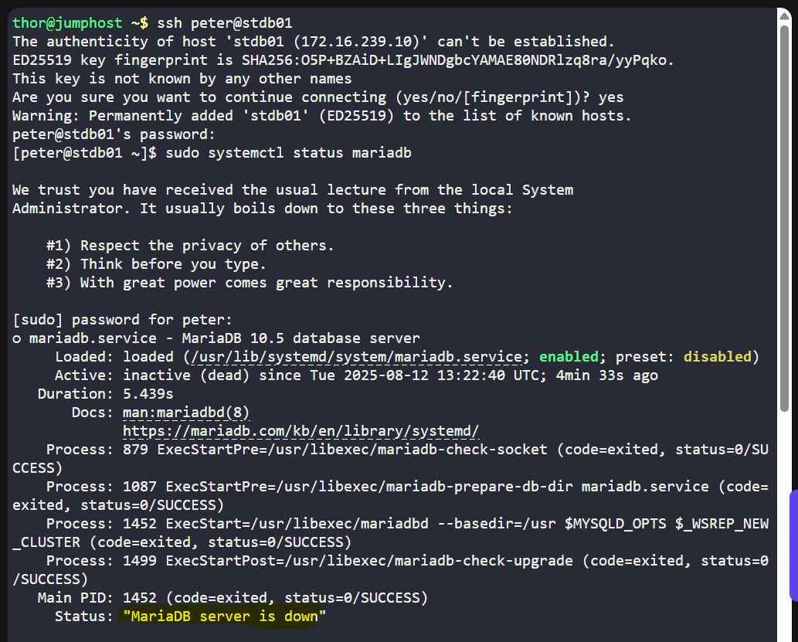
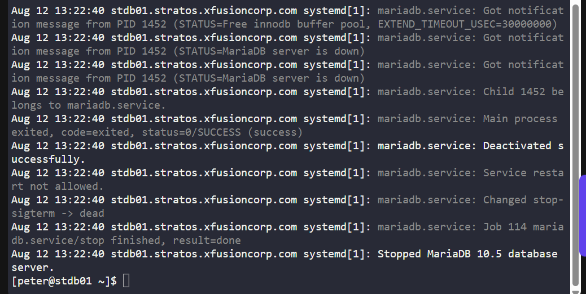
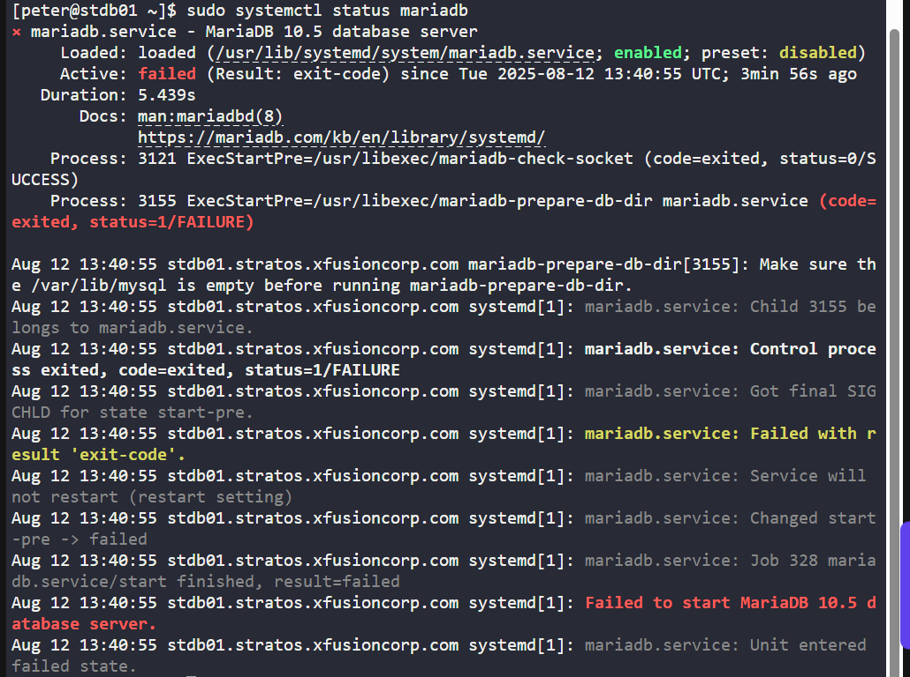
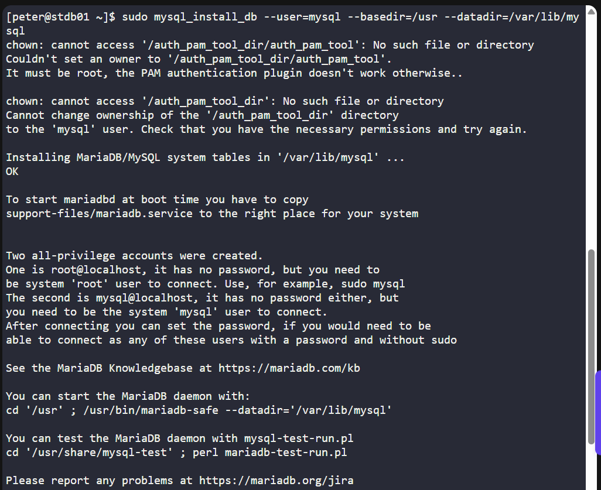
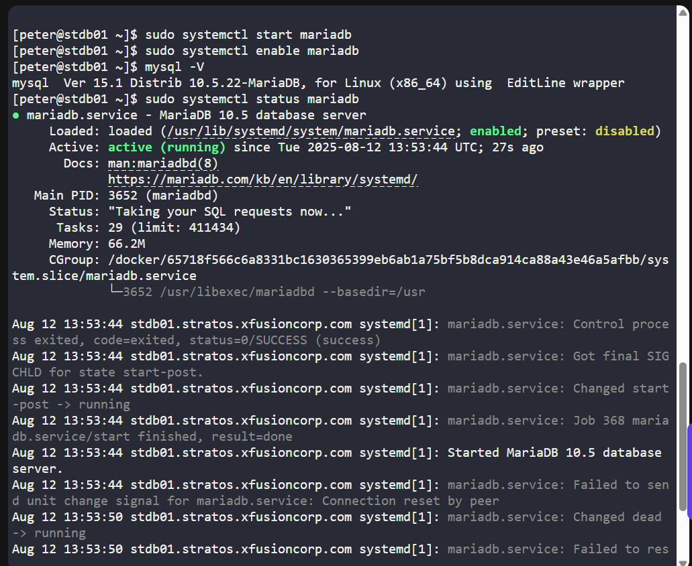

# 🧪 100 Days of DevOps – Day 9 
## ✅ Task: Start and Enable MariaDB Service on Database Server

```text
There is a critical issue going on with the Nautilus application in Stratos DC.
The production support team identified that the application is unable to connect to the database.
After digging into the issue, the team found that mariadb service is down on the database server.

Look into the issue and fix the same.
```

---

### 📝 Task Description

There is a critical issue with the **Nautilus application** in **Stratos DC**.  
The production support team identified that the application is unable to connect to the database.  
After investigation, they found that the **MariaDB** service is **down** on the **Database Server**.

Your task is to:

- Start the **MariaDB** service.
- Enable it to **start automatically** on system boot.
- Verify that the service is running.

---

### 📦 Step 1: Log in to the Database Server

```bash
ssh peter@stdb01
```

---

### 📦 Step 2: Check the MariaDB Service Status

```bash
sudo systemctl status mariadb
```

#### Command: `sudo systemctl status mariadb`

**Description:**  
This command displays the current status of the **MariaDB** service, including whether it is active (running), inactive (stopped), or failed. It also shows details such as the process ID (PID), uptime, recent log entries, and any errors.

**Breakdown of Parts:**
- `sudo` — Runs the command with superuser (root) privileges, necessary to check system service statuses.
- `systemctl` — The command-line tool for managing `systemd` services.
- `status` — Requests the current status of the service.
- `mariadb` — The name of the MariaDB database service.

**Purpose in Context:**  
Used to verify that the MariaDB server is running and functioning properly before connecting to it or performing database operations.




---

### 📦 Step 3: Try to Start the MariaDB Service

```bash
sudo systemctl start mariadb
```

> Error Encountered:

```text
Job for mariadb.service failed because the control process exited with error code.
See "systemctl status mariadb.service" and "journalctl -xeu mariadb.service" for details.
```


---

### 📜 Step 4: Review Detailed Error Logs by checking the status again.

```bash
sudo systemctl status mariadb
```



> Encountered error: 
```yaml
Aug 12 13:33:03 stdb01.stratos.xfusioncorp.com mariadb-prepare-db-dir[2785]: Make sure the /var/lib/mysql is empty before running mariadb-prepare-db-dir.
```

That means the MariaDB data directory already has files in it, so the initialization step mariadb-prepare-db-dir fails.
This usually happens when:
- MariaDB was already initialized but was uninstalled/reinstalled.
- Files exist but have wrong permissions/ownership.
- There’s partial initialization from a previous failed start.

---

### 🔧 Fix the issue

#### 1: Check the Data Directory

```bash
sudo ls -ld /var/lib/mysql
sudo ls -l /var/lib/mysql
```


#### Command: `sudo ls -ld /var/lib/mysql`

**Description:**  
This command lists detailed information about the `/var/lib/mysql` directory without showing its contents. The `-l` flag displays long-format details, and `-d` ensures that the directory itself (not its contents) is listed.

**Breakdown of Parts:**
- `sudo` — Runs the command with superuser (root) privileges, required because `/var/lib/mysql` is typically owned by the `mysql` user and not accessible to normal users.
- `ls` — Lists information about files or directories.
- `-l` — Displays the output in **long format** (permissions, owner, group, size, modification time, name).
- `-d` — Shows the **directory entry itself** rather than the files inside it.
- `/var/lib/mysql` — The path to the MariaDB/MySQL data directory, where database files are stored.

**Purpose in Context:**  
Used to check the ownership, permissions, and attributes of the MySQL data directory to ensure the database server can read and write to it.

---

#### 2: Create Data Directory and Set Permissions

```bash
sudo mkdir -p /var/lib/mysql
sudo chown mysql:mysql /var/lib/mysql
sudo chmod 750 /var/lib/mysql
```


#### Command Description: Create and Secure MySQL Data Directory

**Description:**  
These commands create the MySQL data directory (if it doesn't exist), set the correct ownership to the `mysql` user and group, and apply secure permissions.

**Breakdown of Parts:**

##### Create the Directory
- `sudo`— Runs with superuser privileges (needed for system directories).  
- `mkdir` — Creates a directory.  
- `-p` — Creates parent directories if they don’t exist, and avoids errors if it already exists.  
- `/var/lib/mysql` — Default MySQL/MariaDB data directory.

---

##### Set Ownership
- `chown` — Changes ownership of a file or directory.  
- `mysql:mysql` — Sets both user and group ownership to `mysql`.  
- `Purpose` — Ensures the MySQL process can read/write in its data directory.

---

##### Set Permissions
- `chmod` — Changes file/directory permissions.  
- `750` — Means:  
  - Owner: read, write, execute (`rwx`)  
  - Group: read, execute (`r-x`)  
  - Others: no access (`---`)  
- `Purpose` — Restricts access so only MySQL and privileged users can access the directory.

---

#### 3: Initialize MariaDB Data Directory
```bash
sudo mysql_install_db --user=mysql --basedir=/usr --datadir=/var/lib/mysql
```



#### Command Description: Initialize MySQL Data Directory

**Description:**  
This command initializes the MySQL (or MariaDB) data directory, creating the system tables and preparing it for the database server to start.

**Breakdown of Parts:**

##### 1. **sudo**
Runs the command with superuser privileges, required for modifying system directories like `/var/lib/mysql`.

##### 2. **mysql_install_db**
A utility that sets up the initial MySQL system tables in the data directory.

##### 3. **--user=mysql**
Specifies that the initialization process should run as the `mysql` user, ensuring correct ownership and permissions for the database files.

##### 4. **--basedir=/usr**
Specifies the base directory where MySQL’s installation files are located.

##### 5. **--datadir=/var/lib/mysql**
Specifies the location of the MySQL data directory where databases will be stored.

**Purpose in Context:**  
- Creates the necessary system tables for MySQL/MariaDB to operate.  
- Ensures the correct file structure is present before starting the database service.  
- Avoids permission issues by running under the correct user.

---

#### ☑️ Issue is now fix. Let's get back to starting and enabling MariaDB

### 📦 Step 3: Start the MariaDB Service

```bash
sudo systemctl start mariadb
```

### 📦 Step 4: Enable MariaDB to Start on Boot

```bash
sudo systemctl enable mariadb
```

> You should see active (running) in the output.

### 📦 Step 5: Verify

```bash
mysql -V
sudo systemctl status mariadb
```

#### Command Description: `mysql -V`

**Purpose**
Displays the installed version of the MySQL client (or MariaDB client if MariaDB is installed).

**Why Use It**
- To verify if MySQL/MariaDB client tools are installed.
- To check the version for compatibility with applications or scripts.
- Useful for troubleshooting database-related tasks.

**Example Output**
```bash
mysql  Ver 15.1 Distrib 10.5.22-MariaDB, for Linux (x86_64) using readline 5.1
```

---

## ✅ Task Complete!


