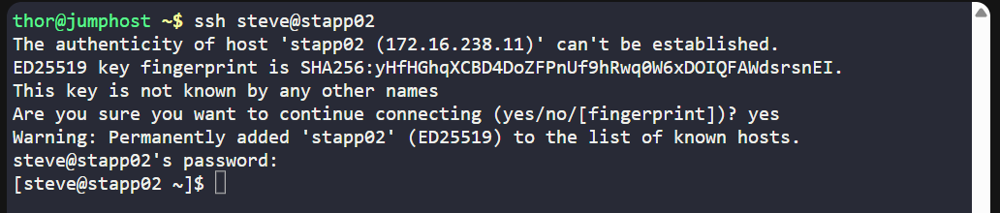
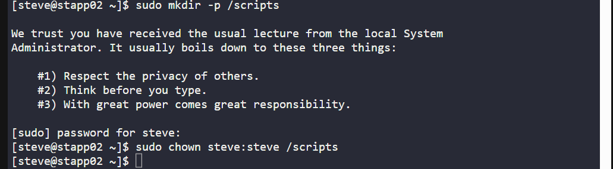
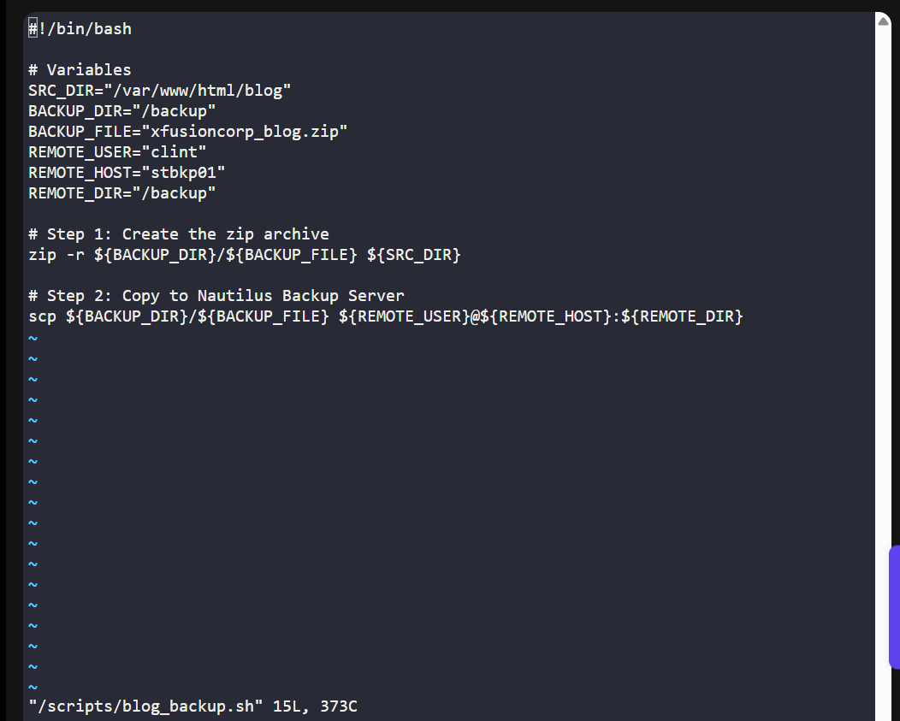
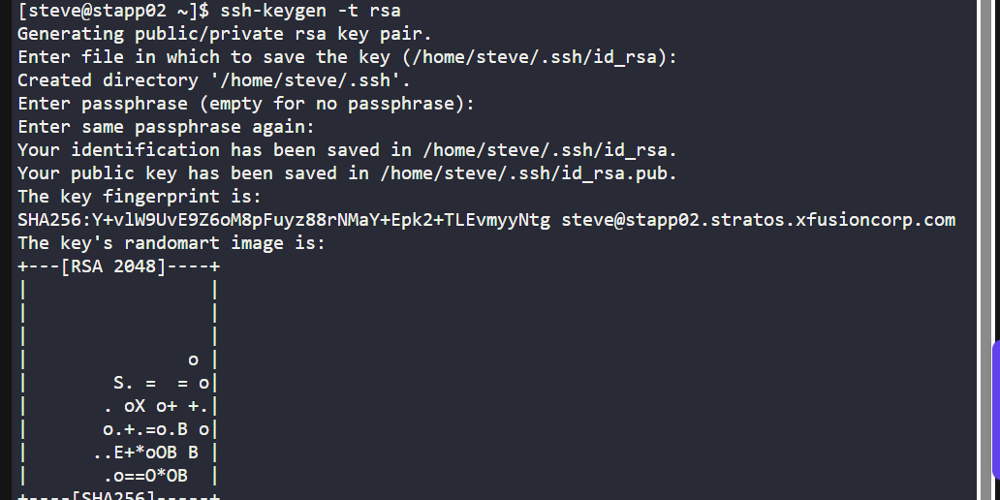
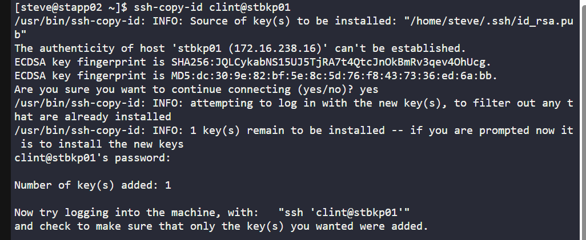
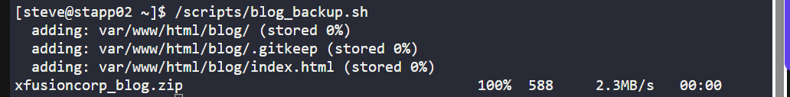
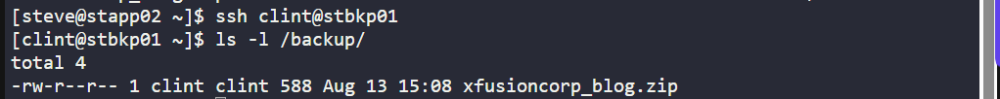

# 🧪 100 Days of DevOps – Day 10
## ✅ Task: Automate Website Backup to Local & Remote Server

```text
The production support team of xFusionCorp Industries is working on developing some bash scripts to automate different day to day tasks.
One is to create a bash script for taking websites backup. They have a static website running on App Server 2 in Stratos Datacenter,
and they need to create a bash script named blog_backup.sh which should accomplish the following tasks. (Also remember to place the script under /scripts directory on App Server 2).

a. Create a zip archive named xfusioncorp_blog.zip of /var/www/html/blog directory.
b. Save the archive in /backup/ on App Server 2. This is a temporary storage, as backups from this location will be clean on weekly basis. Therefore, we also need to save this backup archive on Nautilus Backup Server.
c. Copy the created archive to Nautilus Backup Server server in /backup/ location.
d. Please make sure script won't ask for password while copying the archive file. Additionally, the respective server user (for example, tony in case of App Server 1) must be able to run it.
```

---

### 📝 Task Description
We will create and configure the blog_backup.sh script under /scripts on App Server 1 to:
- Backup the /var/www/html/blog directory.
- Store the backup locally in /backup/.
- Transfer the backup to Nautilus Backup Server without requiring a password.
- Ensure the script is executable by the application user.

---

### 📦 Step 1: SSH into App Server 2

```bash
ssh steve@stapp02
```
> 📝 If prompted with "Are you sure you want to continue connecting (yes/no)?", type yes and press Enter.

When prompted, type the password below and press Enter:

```bash
Am3ric@
```


---

### 📦 Step 2: Create /scripts Directory

```bash
sudo mkdir -p /scripts
sudo chown steve:steve /scripts
```



#### Commands Description: Creating and Setting Permissions for `/scripts` Directory

#### Command 1: Create Directory
```bash
sudo mkdir -p /scripts
```

**Purpose:**
- Creates the `/scripts` directory in the root filesystem.
- The `-p` flag ensures that parent directories are created as needed and suppresses errors if the directory already exists.

#### Command 2: Change Ownership
```bash
sudo chown steve:steve /scripts
```

**Purpose:**
- Changes the ownership of the /scripts directory to the user tony and the group tony.
- This allows the specified user to have full control over the directory contents.

---

### 📦 Step 3: Write the blog_backup.sh Script

```bash
vi /scripts/blog_backup.sh
```


**Purpose:**
- Opens (or creates if it doesn’t exist) the file `/scripts/blog_backup.sh` in the `vi` text editor.
- This is typically used to write or modify a Bash script.

paste

```bash
#!/bin/bash

# Variables
SRC_DIR="/var/www/html/blog"
BACKUP_DIR="/backup"
BACKUP_FILE="xfusioncorp_blog.zip"
REMOTE_USER="clint"
REMOTE_HOST="stbkp01"
REMOTE_DIR="/backup"

# Step 1: Create the zip archive
zip -r ${BACKUP_DIR}/${BACKUP_FILE} ${SRC_DIR}

# Step 2: Copy to Nautilus Backup Server
scp ${BACKUP_DIR}/${BACKUP_FILE} ${REMOTE_USER}@${REMOTE_HOST}:${REMOTE_DIR}
```

Save & exit.
> Press `Esc`, then type `:wq` and press `Enter`.



---

### 📦 Step 4: Make the Script Executable

```bash
chmod +x /scripts/blog_backup.sh
```


**Description:**
- `chmod` → Stands for change mode, used to modify file permissions in Linux.
- `+x` → Adds the execute permission to the file. This means you can now run it as a program or script.
- `/scripts/blog_backup.sh` → The path to the script file you’re making executable.

**Purpose:**
> Allows the script to be run directly without needing `bash scriptname`.

---

### 📦 Step 5: Configure Passwordless SSH
On App Server 1 (as tony):

```bash
ssh-keygen -t rsa
```
- When prompted:
  - File to save the key: Press Enter to accept the default `(/home/tony/.ssh/id_rsa)`
  - Passphrase: Press Enter twice (no passphrase for automation)



#### Command: Generate SSH Key Pair
```bash
ssh-keygen -t rsa
```

**Purpose:**
- Creates a new SSH key pair (public and private keys) using the RSA algorithm.
- By default, stores the keys in the `~/.ssh` directory (`id_rsa` for private key, `id_rsa.pub` for public key).
- The public key will be used to authenticate without requiring a password, while the private key remains secure on the local machine.


```bash
ssh-copy-id clint@stbkp01
```

Enter password for clint when prompted:
```bash
H@wk3y3
```
> 📝 Now, scp will work without asking for a password.



#### Command: Copy Public Key to Remote Server
```bash
ssh-copy-id clint@stbkp01
```

**Purpose:**
- Transfers the public key `(id_rsa.pub)` to the remote server’s `~/.ssh/authorized_keys` file for the user tony.
- Enables passwordless `SSH login` to nautilus_backup_server for the tony user.
- Simplifies secure remote access by removing the need to manually enter a password each time.

---

### 📦 Step 6: Test the Script
```bash
/scripts/blog_backup.sh
```



Check /backup/ on Nautilus Backup Server:
```
ssh clint@stbkp01
ls -l /backup/
```
> You should see xfusioncorp_blog.zip.



## ✅ Task Complete!
