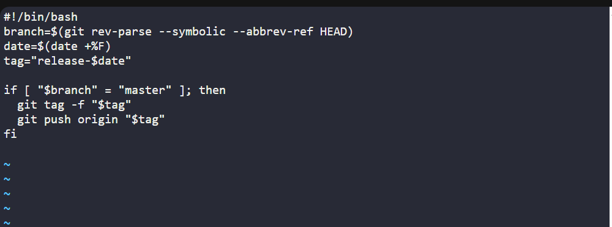
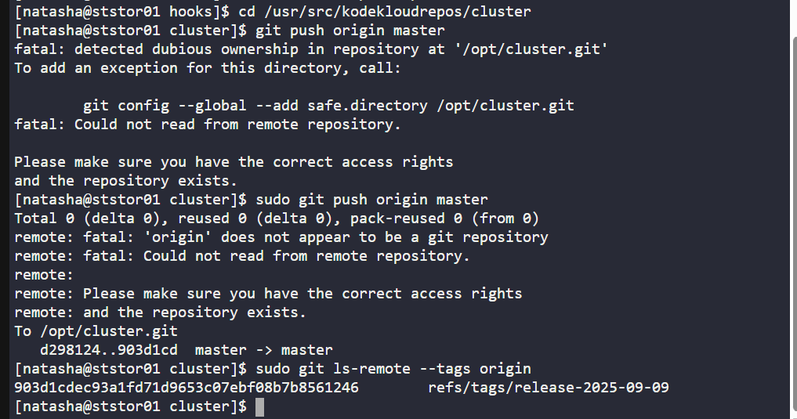

# 🧪 100 Days of DevOps – Day 34
## ✅ Task: Git Hooks

```
The Nautilus application development team was working on a git repository /opt/cluster.git
which is cloned under /usr/src/kodekloudrepos directory present on Storage server in Stratos DC.
The team want to setup a hook on this repository, please find below more details:

1. Merge the feature branch into the master branch`, but before pushing your changes complete below point.

2. Create a post-update hook in this git repository so that whenever any changes are pushed to the master branch,
it creates a release tag with name release-2023-06-15, where 2023-06-15 is supposed to be the current date.
For example if today is 20th June, 2023 then the release tag must be release-2023-06-20.
Make sure you test the hook at least once and create a release tag for today's release.

3. Finally remember to push your changes.
```

---

Task
- SSH into Storage Server
- Navigate to /usr/src/kodekloudrepos/cluster
- Checkout master and merge feature branch
- Create a post-update hook in /opt/cluster.git/hooks
- Hook should create a release tag with current date when master branch is pushed
- Test by pushing master branch → confirm release tag created

---

### 🔁 Step 1: SSH into Storage Server

```bash
ssh natasha@ststor01
```

password:
```bash
Bl@kW
```

---

### 🔁 Step 2: Navigate to Repo

Go to repo
```bash
cd /usr/src/kodekloudrepos/cluster
```

then check the status
```bash
git status
```

output: 
```nginx
On branch feature
nothing to commit, working tree clean
```


---

### 🔁 Step 3: Merge Feature into Master

```bash
sudo git checkout master
sudo git merge feature
```
> Output should confirm merge success (fast-forward or merge commit depending on changes).

---

### 🔁 Step 4: Create Post-Update Hook
Move to bare repo hooks folder:
```bash
cd /opt/cluster.git/hooks
```


Create hook:
```bash
sudo vi post-update
```

insert
```bash
#!/bin/bash
branch=$(git rev-parse --symbolic --abbrev-ref HEAD)
date=$(date +%F)
tag="release-$date"

if [ "$branch" = "master" ]; then
  git tag -f "$tag"
  git push origin "$tag"
fi
```



Make it executable:
```bash
sudo chmod +x post-update
```

---

### 🔁 Step 5: Push to Trigger Hook

Back in working repo:
```bash
cd /usr/src/kodekloudrepos/cluster
sudo git push origin master
```

Verify tags on remote:
```bash
sudo git ls-remote --tags origin
```

Output
```nginx
903d1cdec93a1fd71d9653c07ebf08b7b8561246        refs/tags/release-2025-09-09
```
> The tag date is today's date (September 9, 2025)



---

## Explanation of Key Commands

| Command                         | Meaning                                                        |
| ------------------------------- | -------------------------------------------------------------- |
| `git checkout master`           | Switch to the master branch.                                   |
| `git merge feature`             | Merge feature branch changes into master.                      |
| `/opt/cluster.git/hooks`        | Directory where git hook scripts live in the **bare repo**.    |
| `post-update`                   | Hook script executed after a push is made to the repository.   |
| `date +%F`                      | Prints current date in `YYYY-MM-DD` format.                    |
| `git tag -f release-YYYY-MM-DD` | Creates (or overwrites) a release tag with today’s date.       |
| `git push origin master`        | Pushes master branch → triggers the `post-update` hook.        |
| `git ls-remote --tags origin`   | Confirms that the release tag exists in the remote repository. |

---

## ✅ Task Completed
- Feature branch merged into master.
- Post-update hook created in /opt/cluster.git/hooks/.
- Pushing master triggered hook → auto release tag created (release-2025-09-04).
- Verified tag exists in remote repository.

