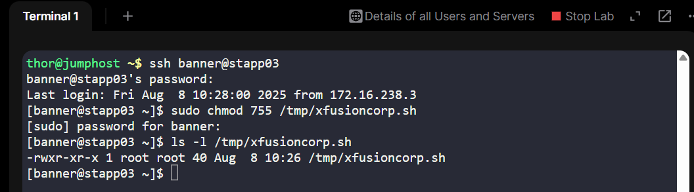

# 🧪 100 Days of DevOps – Day 4  
## ✅ Task 4: Grant Executable Permissions to Script for All Users

---

### 📝 Task Description

The sysadmin team of xFusionCorp Industries created a bash script named `xfusioncorp.sh` and stored it in `/tmp/` on **App Server 1**.  

Your task:
1. Grant **executable permissions** to the `/tmp/xfusioncorp.sh` script.  
2. Ensure **all users** can execute it.

---

### 🔁 Step 1: SSH into App Server 1

From the jump host, connect to **App Server 1**:

```bash
ssh tony@stapp01
```
- `banner` – username
- `stapp03` – hostname of App Server 1
> 📝 If prompted, confirm with yes and press Enter.

---

### 🔐 Step 2: Enter the Password

When prompted, type the password below and press Enter:

```css
BigGr33n
```

> ⚠️ The password is invisible while typing — just type it and hit Enter.

---

### 🛠️ Step 3: Grant Executable Permissions
Run the following command:

```bash 
sudo chmod 755 /tmp/xfusioncorp.sh
```

# Command: `sudo chmod 755 /tmp/xfusioncorp.sh`

## Part Descriptions
| Part                  | Description |
|-----------------------|-------------|
| `sudo`                | Runs the command with superuser (root) privileges — needed because `/tmp/xfusioncorp.sh` may not be owned by your user. |
| `chmod`               | Command to change file permissions. |
| `755`                 | Numeric (octal) permission mode: gives the owner full rights (read, write, execute), and group/others read & execute only. |
| `/tmp/xfusioncorp.sh` | Path to the file whose permissions you are modifying — in this case, a script in `/tmp`. |

---

## What `755` Means
Breaking it into the three permission categories:

| Category | Number | Permission            | Symbol Form |
|----------|--------|-----------------------|-------------|
| Owner    | 7      | Read, Write, Execute  | `rwx`       |
| Group    | 5      | Read, Execute         | `r-x`       |
| Others   | 5      | Read, Execute         | `r-x`       |

---

## Effect of This Command
- **Owner** can read, modify, and run the script.  
- **Group** can read and run it, but not modify it.  
- **Others** can also read and run it, but not modify it.  

---

### 🔍 Step 4: Verify the Permissions
Check the file permissions:

```bash
ls -l /tmp/xfusioncorp.sh
```

Expected output example:

```bash
-rwxr-xr-x 1 root root 123 Aug  8 12:00 /tmp/xfusioncorp.sh
```
> `rwxr-xr-x` → Means owner, group, and others can execute the script.

---

## ✅ Task Complete!



