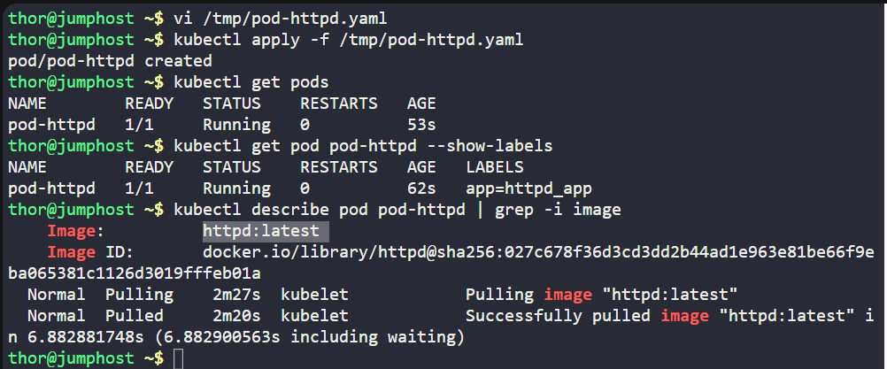
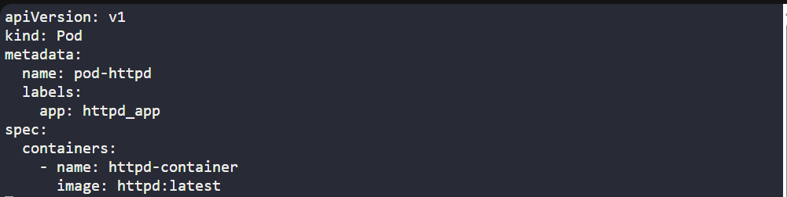

# ☸️ 100 Days of DevOps – Day 49
## ✅ Task: Deploy Applications with Kubernetes Deployments

```text
The Nautilus DevOps team is delving into Kubernetes for app management.
One team member needs to create a deployment following these details:

Create a deployment named httpd to deploy the application httpd using the image httpd:latest (ensure to specify the tag)

Note: The kubectl utility on jump_host is set up to interact with the Kubernetes cluster.
```

---

📝 Task List
- Go to jump host
- Create YAML manifest /tmp/pod-httpd.yaml
- Apply manifest with kubectl
- Verify pod & label

---

### 🔁 Step 1: Create Pod YAML

On the jump host:
```bash
vi /tmp/pod-httpd.yaml
```

Insert the following:
```yaml
apiVersion: v1
kind: Pod
metadata:
  name: pod-httpd
  labels:
    app: httpd_app
spec:
  containers:
    - name: httpd-container
      image: httpd:latest
```

Save & exit. (:wq!)

---

### 🔁 Step 2: Deploy Pod
```bash
kubectl apply -f /tmp/pod-httpd.yaml
```
- `-f` = "filename"

---

### 🔁 Step 3: Verify

Check pod status:
```bash
kubectl get pods
```

Check label:
```bash
kubectl get pod pod-httpd --show-labels
```

output:
```nginx
NAME        READY   STATUS    RESTARTS   AGE   LABELS
pod-httpd   1/1     Running   0          62s   app=httpd_app
```
> successfully created pod-httpd

Check container inside pod:
```bash
kubectl describe pod pod-httpd | grep -i image
```
> verified image used = httpd:latest

---




---

## 🗝️ Explanation of Key Commands – Kubernetes Deployment

| Command                                                  | Description                                                  |
| -------------------------------------------------------- | ------------------------------------------------------------ |
| `vi /tmp/deploy-httpd.yaml`                              | Opens a file to define the Deployment manifest.              |
| `kubectl apply -f /tmp/deploy-httpd.yaml`                | Creates the Deployment as per the manifest.                  |
| `kubectl get deployments`                                | Lists all Deployments, showing replicas and availability.    |
| `kubectl get pods -l app=httpd_app`                      | Filters Pods created by the Deployment using label selector. |
| `kubectl describe pod -l app=httpd_app \| grep -i image` | Confirms the container image being used (`httpd:latest`).    |

---

## ✅ Task Completed
- Pod pod-httpd created
- Container httpd-container runs httpd:latest
- Label app=httpd_app applied


