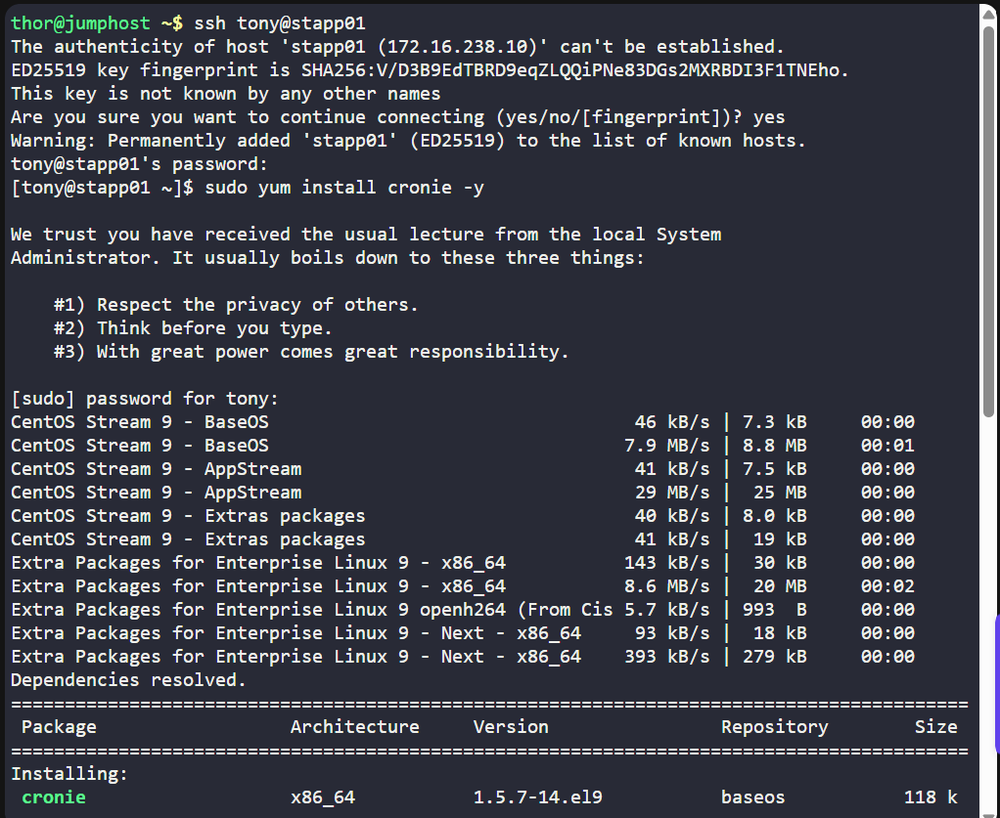
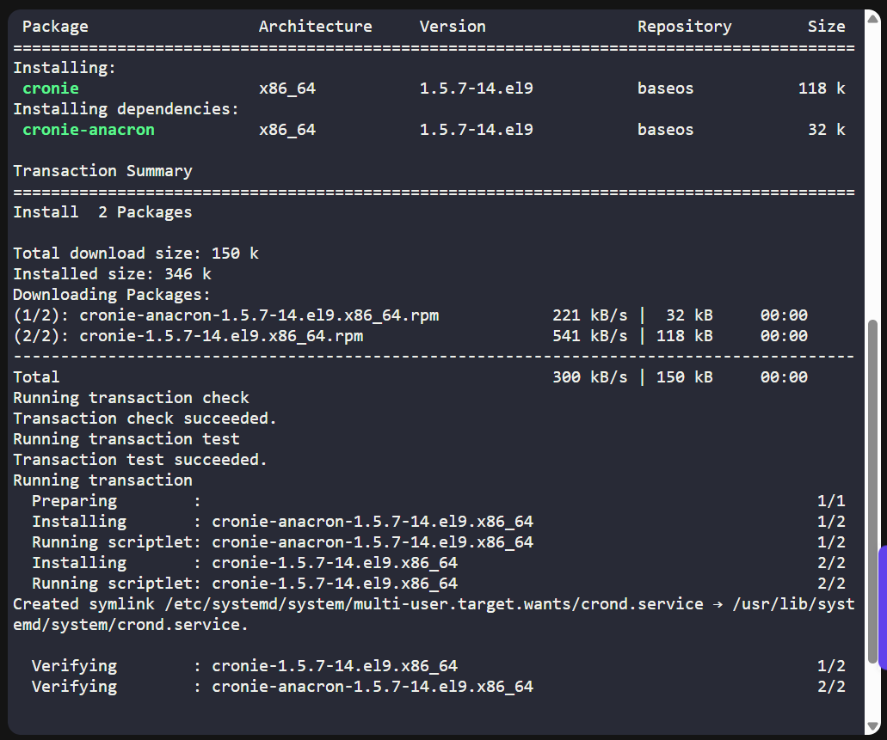
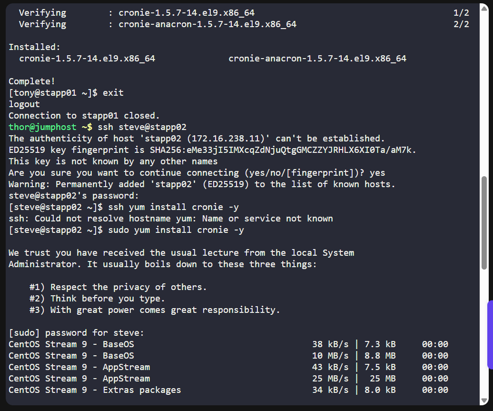
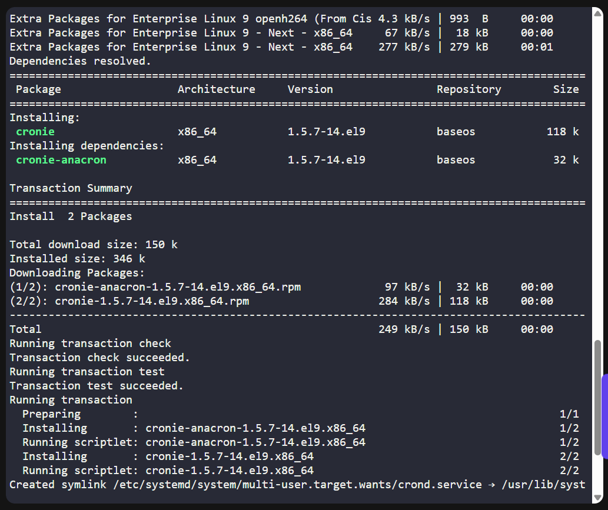
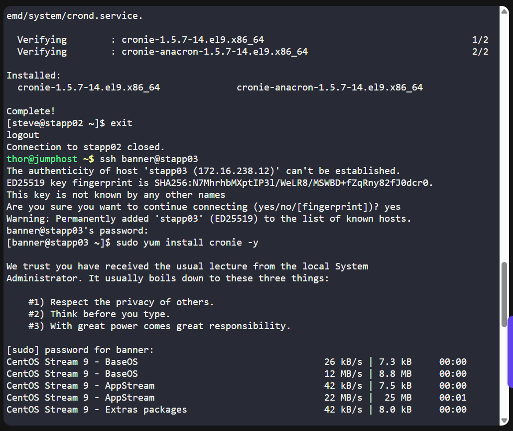
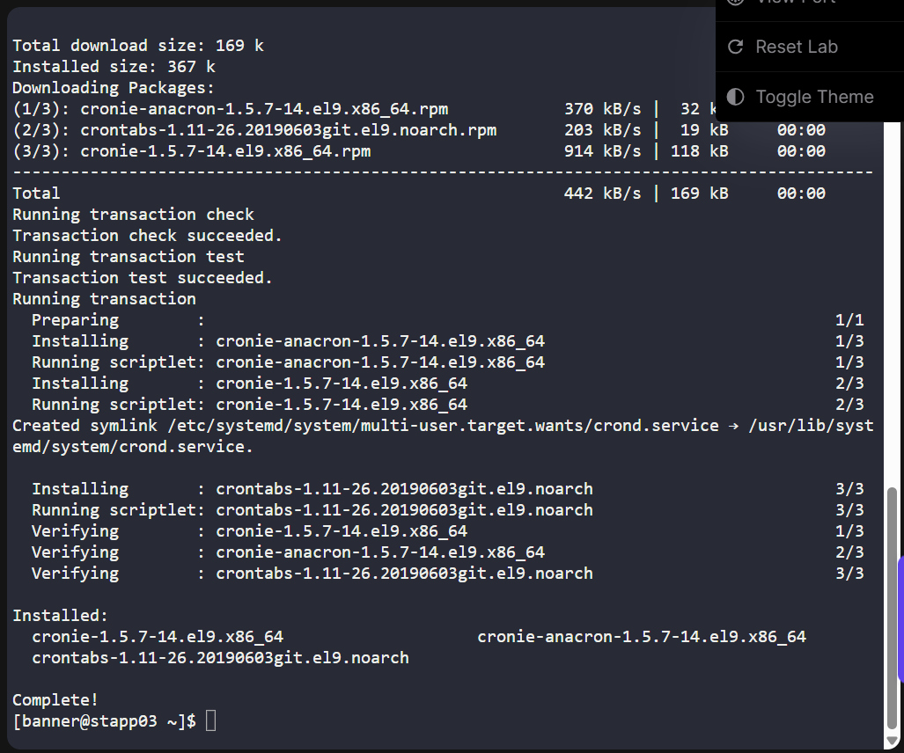
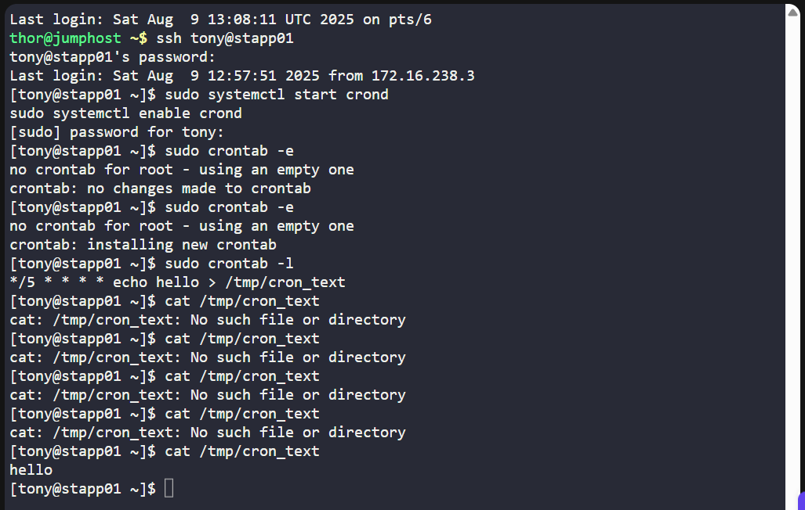
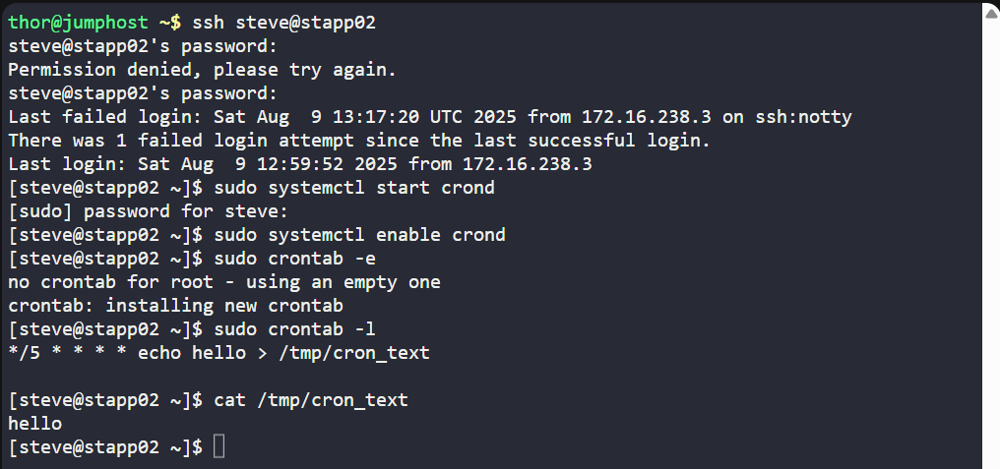
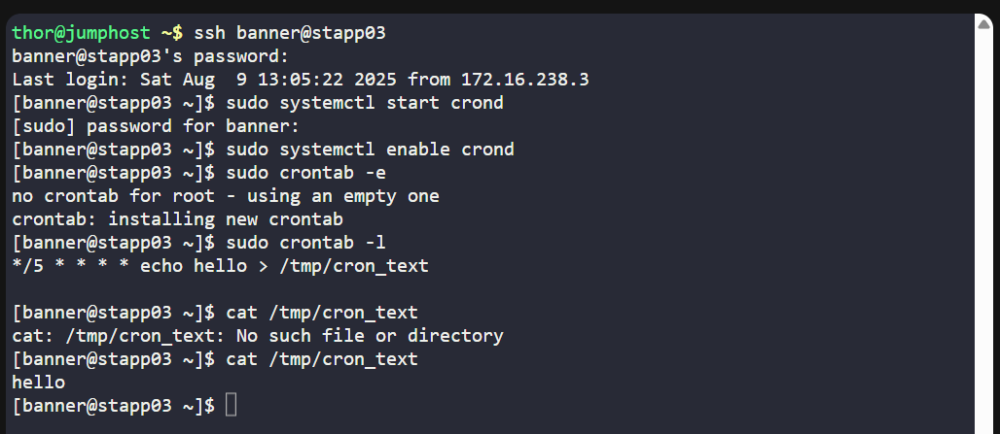

# 🧪 100 Days of DevOps – Day 6  
## ✅ Task 7: Configure Cron Job for Root on All App Servers

```text
The Nautilus system admins team has prepared scripts to automate several day-to-day tasks. They want them to be deployed on all app servers in Stratos DC on a set schedule. Before that they need to test similar functionality with a sample cron job. Therefore, perform the steps below:

a. Install cronie package on all Nautilus app servers and start crond service.
b. Add a cron */5 * * * * echo hello > /tmp/cron_text for root user.`
```

---

### 📝 Task Description

The Nautilus system admins team wants to test automated task execution before deploying production scripts.  
Your task:

1. Install `cronie` package on **all App Servers** in Stratos DC.  
2. Start the `crond` service.  
3. Configure a cron job for **root** that runs every 5 minutes and writes `"hello"` to `/tmp/cron_text`.

---

### 🔁 Step 1: SSH into Each App Server

From the jump host, connect to each server one by one:  

```bash
ssh tony@stapp01       # App Server 1
ssh steve@stapp02      # App Server 2
ssh banner@stapp03     # App Server 3
```
> For each server: 📝 If prompted with "Are you sure you want to continue connecting (yes/no)?", type `yes` and press Enter.

---

### 🔐 Step 2: Enter the Password

For each server: when prompted, type the password below and press Enter

> ⚠️ The password is invisible while typing — just type it and hit Enter.

---

### 📦 Step 3: Install Cronie Package

On each server, run: 

```bash
sudo yum install cronie -y
```

### Command Description: `sudo yum install cronie -y`

| Part           | Description |
|----------------|-------------|
| `sudo`         | Runs the command with superuser (root) privileges — required for installing packages. |
| `yum`          | The package manager used by RHEL, CentOS, and other Red Hat–based Linux distributions to install, update, and remove software. |
| `install`      | Tells `yum` to install one or more packages. |
| `cronie`       | A package that provides the **cron daemon** (`crond`) and related utilities, used to schedule and run jobs periodically. |
| `-y`           | Automatically answers “yes” to prompts, allowing the install to proceed without manual confirmation. |


## Purpose
This command installs **Cronie**, which is the implementation of the `cron` service in many Linux distributions.  
It allows you to:
- Schedule scripts and commands to run automatically at specific times or intervals  
- Manage scheduled jobs using `crontab`  

---

### 🛠️ Step 4: Start and Enable the crond Service

```bash
sudo systemctl start crond
sudo systemctl enable crond
```

### Command Description: `sudo systemctl start crond` and `sudo systemctl enable crond`

| Command                       | Part         | Description |
|--------------------------------|--------------|-------------|
| `sudo systemctl start crond`  | `sudo`       | Runs the command with superuser (root) privileges — required to manage system services. |
|                                | `systemctl` | A utility to examine and control the `systemd` system and service manager. |
|                                | `start`     | Starts the specified service immediately. |
|                                | `crond`     | The **cron daemon** service that runs scheduled jobs defined in `crontab`. |
| `sudo systemctl enable crond` | `sudo`       | Runs the command with superuser (root) privileges. |
|                                | `systemctl` | A utility to examine and control the `systemd` system and service manager. |
|                                | `enable`    | Configures the service to start automatically at boot. |
|                                | `crond`     | The cron daemon service. |

## Purpose
These commands:
1. **Start** the cron daemon (`crond`) immediately, allowing scheduled jobs to run.  
2. **Enable** the cron daemon so it will start automatically each time the system boots.  

This ensures that periodic tasks scheduled in `crontab` will always be executed without manual intervention.

---

### ⏲️ Step 5: Add the Cron Job for Root

Edit the root user’s cron table:

```bash
sudo crontab -e
```

### Command Description: `sudo crontab -e`

| Part         | Description |
|--------------|-------------|
| `sudo`       | Runs the command with superuser (root) privileges — required if you want to edit the root user’s cron jobs. |
| `crontab`    | The command used to create, view, or edit a user’s cron jobs. |
| `-e`         | Opens the crontab file for editing in the default text editor (often `vi` or `nano`). |

---

#### Purpose
This command opens the **root user’s cron table** so you can add or edit scheduled tasks.  
Using `sudo` ensures the changes apply to the **root account’s crontab**, not your regular user’s crontab.

#### Example
Inside the editor, you can add a cron job such as:

```bash
*/5 * * * * echo "hello" > /tmp/cron_text
```

---

### 🔍 Step 6: Verify Cron Job Installation

List root’s cron jobs:

```bash
sudo crontab -l
```

### Command Description: `sudo crontab -l`

| Part       | Description |
|------------|-------------|
| `sudo`     | Runs the command with superuser (root) privileges — required if you want to view the root user’s cron jobs. |
| `crontab`  | The command used to create, view, or edit a user’s cron jobs. |
| `-l`       | Lists the current cron jobs for the specified user (root in this case). |

## Purpose
This command displays all scheduled cron jobs for the **root user**.  
It’s useful for checking if tasks are already scheduled or confirming that a new cron job has been added.


Expected output:

```bash
*/5 * * * * echo hello > /tmp/cron_text
```

### Cron Job Description: `*/5 * * * * echo hello > /tmp/cron_text`

| Field   | Value  | Description |
|---------|--------|-------------|
| Minute  | `*/5`  | Run every 5 minutes. |
| Hour    | `*`    | Every hour. |
| Day     | `*`    | Every day of the month. |
| Month   | `*`    | Every month. |
| Weekday | `*`    | Every day of the week. |

---

#### Command
```bash
echo hello > /tmp/cron_text
```

- `echo hello` → Outputs the text hello.
- `>` → Redirects the output to a file (overwrites existing content).
- `/tmp/cron_text` → The file where the output will be saved, located in the /tmp directory.

#### Purpose
This cron job will:
- Run every 5 minutes.
- Overwrite /tmp/cron_text with the word hello each time it runs.

---

### 🧪 Step 7: Wait and Check

After 5–6 minutes, check if the file is created:

```bash
cat /tmp/cron_text
```

It should show:

```nginx
hello
```

### Command Description: `cat /tmp/cron_text`

| Part               | Description |
|--------------------|-------------|
| `cat`              | A command that reads and displays the contents of a file to standard output (the terminal). |
| `/tmp/cron_text`   | The path to the file you want to display — in this case, a file in the `/tmp` directory. |

---

#### Purpose
This command displays the contents of `/tmp/cron_text` in the terminal.  
It’s often used to quickly check the output of scripts or cron jobs that write to this file.

---

## ✅ Task Complete!










