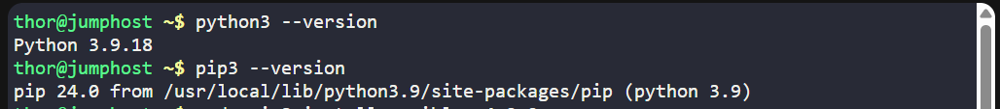
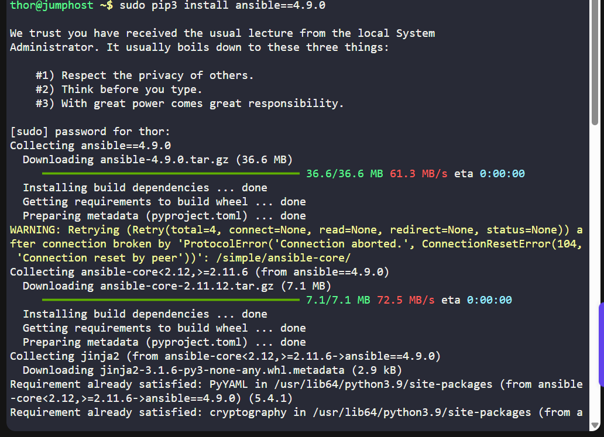
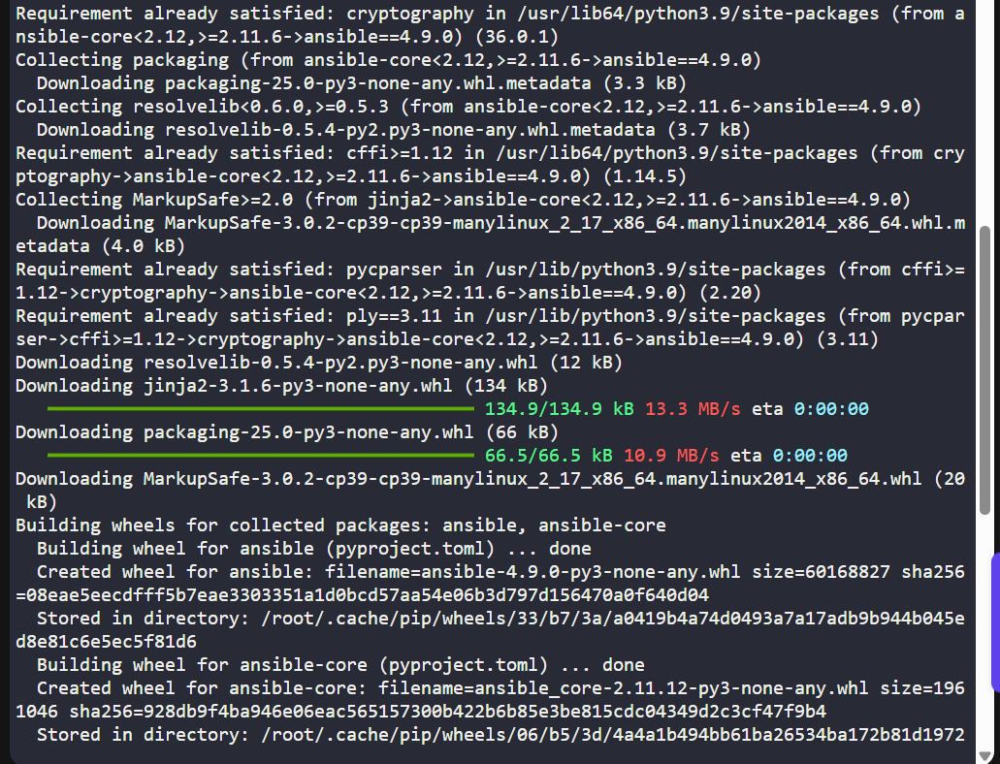
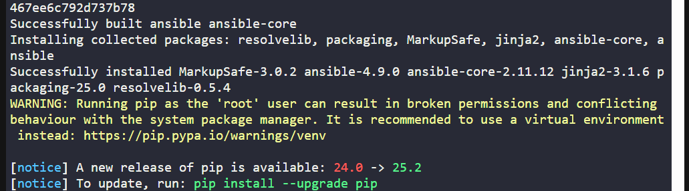
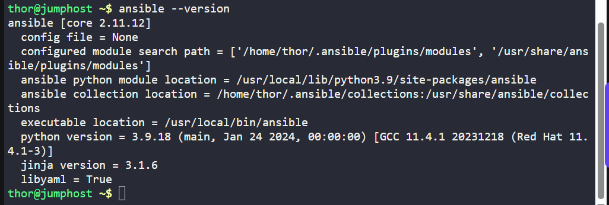

# 🧪 100 Days of DevOps – Day 8  
## ✅ Task: Install Ansible

```text
During the weekly meeting, the Nautilus DevOps team discussed about the automation and
configuration management solutions that they want to implement.
While considering several options, the team has decided to go with Ansible
for now due to its simple setup and minimal pre-requisites.
The team wanted to start testing using Ansible, so they have decided to use jump host as an
Ansible controller to test different kind of tasks on rest of the servers.


Install ansible version 4.9.0 on Jump host using pip3 only.
Make sure Ansible binary is available globally on this system,
i.e all users on this system are able to run Ansible commands.
```

---

### 📝 Task Description

The Nautilus DevOps team has chosen **Ansible** for automation testing.  
You need to install **Ansible v4.9.0** on the **Jump Host** using `pip3` **only**, ensuring that:

- The binary is available **globally**.
- All users on the system can run Ansible commands.

---

### Let's Explain what is Ansible:

**Ansible** is an open-source tool that automates:
- Software installation
- System configuration
- Task execution across multiple computers

It is **agentless**, meaning you don’t install anything on the computers you manage.  
It connects to them using **SSH** (or WinRM for Windows) and runs tasks written in easy-to-read **YAML files** called **playbooks**.

## How It Works
1. You have a **controller** (your computer with Ansible installed).
2. You have **managed nodes** (servers or devices you control).
3. You write **playbooks** to tell Ansible what to do.
4. Ansible runs the tasks on all managed nodes automatically.

**Example Use:**  
- Install and configure a web server on multiple machines at once.

---

## Let's Start the task!

### 📦 Step 1: Ensure pip3 is Installed

Log in to the **Jump Host** as `thor` (or root):

```bash
thor@jumphost ~$ python3 --version
thor@jumphost ~$ pip3 --version
```



### Command: `python3 --version`

This command checks and displays the currently installed version of **Python 3** on your system.

#### **Breakdown**
- **`python3`** → Specifies that you want to use Python version 3 (instead of Python 2).
- **`--version`** → An option that tells Python to output its version number.

#### **Example Output**
```bash
$ python3 --version
Python 3.9.18
```
> ✅ Use case: To verify Python 3 is installed and check which version is currently active.

### Why Check for Python Before Installing Ansible

#### 1. Ansible is Written in Python
Ansible is developed using the **Python programming language**.  
Its core engine and most modules are Python scripts, so Python must be present on the system to run them.

#### 2. Python is Required on Both Control and Managed Nodes
- **Control Node**: The machine where Ansible is installed and from which commands are issued.
- **Managed Nodes**: The target systems where Ansible executes tasks.  
  Many Ansible modules depend on Python to run on these nodes.

#### 3. Avoid Installation and Runtime Errors
Some minimal operating system images (e.g., minimal CentOS, Alpine Linux) **do not have Python pre-installed**.  
If Python is missing, Ansible installation or execution will fail.

#### 4. Summary
> **No Python = No Ansible**

### `pip3 --version` Command

#### Description
The `pip3 --version` command is used to **check the installed version of `pip`** for Python 3.  
`pip` (short for *Pip Installs Packages*) is the **package manager** for Python, allowing you to install, update, and manage Python packages from the Python Package Index (PyPI) or other sources.

#### Purpose
- **Verify Installation**: Ensures that `pip` is installed and accessible for Python 3.
- **Check Compatibility**: Confirms which version of `pip` you have, helping you know if it supports the packages you want to install.
- **Troubleshooting**: If Ansible or any Python package fails to install, checking the `pip` version can help identify outdated versions that may need upgrading.

#### Example Output
```bash
$ pip3 --version
pip 23.2.1 from /usr/lib/python3/dist-packages/pip (python 3.11)
```
> `pip3 --version` confirms that you have the Python 3 package manager installed and shows its version, which is essential for installing Ansible and other Python-based tools.

---

### If pip3 is missing, install it:

```bash
sudo yum install python3-pip -y       # CentOS / RHEL
# or
sudo apt install python3-pip -y       # Ubuntu / Debian
```

---

### 📥 Step 2: Install Ansible 4.9.0 Globally
Run:

```bash
sudo pip3 install ansible==4.9.0
```





### `sudo pip3 install ansible==4.9.0` Command

#### Description
This command installs **Ansible version 4.9.0** using `pip3` (the Python 3 package manager) **with superuser privileges**.

#### Breakdown
- **`sudo`** → Runs the command with administrator privileges (required to install system-wide packages).
- **`pip3`** → The Python 3 package installer.
- **`install`** → The action to install a package.
- **`ansible==4.9.0`** → Specifies the package name (`ansible`) and the exact version (`4.9.0`) to install.

#### Purpose
- Ensures you install **a specific version** of Ansible rather than the latest one, which is important for compatibility with existing automation scripts or lab requirements.
- Installs Ansible system-wide so it can be used by all users on the machine.

---

### 🛠️ Step 3: Ensure Ansible is in Global PATH
Verify where Ansible is installed:

```bash
which ansible
```
> If the path shows something like `/usr/local/bin/ansible`, it’s already in the global `$PATH`.


### Command: `which ansible`

**Description:**  
This command is used to determine the full path of the `ansible` executable in the system. It searches for the `ansible` binary in the directories listed in the system's `PATH` environment variable and returns its location if found.

**Purpose in Context:**  
After installing Ansible, running this command helps confirm that:
- The installation was successful.
- The `ansible` binary is accessible in your current shell environment.
- You know the exact location of the executable being used (especially important if multiple versions are installed).

> !!! If it’s in a user-local directory `(~/.local/bin)`, move it:

```bash
sudo mv ~/.local/bin/ansible* /usr/local/bin/
```

---

### 🔍 Step 4: Verify Installation (Optional)
Check version:
```bash
ansible --version
```



---

## ✅ Task Complete!
