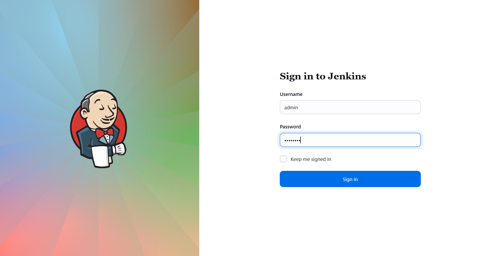

# ☸️ 100 Days of DevOps – Day 81
## ✅ Task: Jenkins Multistage Pipeline

```text
The development team of xFusionCorp Industries is working on to develop a new static website and they are planning to deploy the same
on Nautilus App Servers using Jenkins pipeline. They have shared their requirements with the DevOps team and accordingly we need to
create a Jenkins pipeline job. Please find below more details about the task:

Click on the Jenkins button on the top bar to access the Jenkins UI. Login using username admin and password Adm!n321.

Similarly, click on the Gitea button on the top bar to access the Gitea UI. Login using username sarah and password Sarah_pass123.

There is a repository named sarah/web in Gitea that is already cloned on Storage server under /var/www/html directory.

  1. Update the content of the file index.html under the same repository to Welcome to xFusionCorp Industries and push
  the changes to the origin into the master branch.

  2. Apache is already installed on all app Servers its running on port 8080.

  3. Create a Jenkins pipeline job named deploy-job (it must not be a Multibranch pipeline job) and pipeline should have
  two stages Deploy and Test ( names are case sensitive ). Configure these stages as per details mentioned below.

    a. The Deploy stage should deploy the code from web repository under /var/www/html on the Storage Server, as this location is already
    mounted to the document root /var/www/html of all app servers.

    b. The Test stage should just test if the app is working fine and website is accessible. Its up to you how you design this stage to test it out,
    you can simply add a curl command as well to run a curl against the LBR URL (http://stlb01:8091) to see if the website is working or not.
    Make sure this stage fails in case the website/app is not working or if the Deploy stage fails.

Click on the App button on the top bar to see the latest changes you deployed. Please make sure the required content is loading on the main
URL http://stlb01:8091 i.e there should not be a sub-directory like http://stlb01:8091/web etc.

Note:

1. You might need to install some plugins and restart Jenkins service. So, we recommend clicking on Restart Jenkins when installation is
complete and no jobs are running on plugin installation/update page i.e update centre. Also some times Jenkins UI gets stuck when Jenkins
service restarts in the back end so in such case please make sure to refresh the UI page.

2. Make sure Jenkins job passes even on repetitive runs as validation may try to build the job multiple times.

3. Deployment related tasks should be done by sudo user on the destination server to avoid any permission issues so make sure to configure
your Jenkins job accordingly.

4. For these kind of scenarios requiring changes to be done in a web UI, please take screenshots so that you can share it with us for review
in case your task is marked incomplete. You may also consider using a screen recording software such as loom.com to record and share your work.
```

---

📝 Task Summary


---


### 🔁 Step 1: Access Jenkins & Gitea
  
Jenkins
- URL: Click the Jenkins button on top bar
- Login:
  ```makefile
  Username: admin
  Password: Adm!n321
  ```



Gitea
- URL: Click the Gitea button on top bar
- Login:
  ```makefile
  Username: sarah
  Password: Sarah_pass123
  ```
- check if there's `web` repo


---

### 🔁 Step 2: Install Necessary Jenkins Plugins
  
1. In Jenkins, go to:
```go
Manage Jenkins → Plug-ins
```
 
2. Install the following:
- SSH
- SSH Credentials
- SSH Build Agents
- Git
- Credentials
- CloudBees
- Gitea
- Gitea check
- Publish Over SSH
  
3. Restart Jenkins after installation


